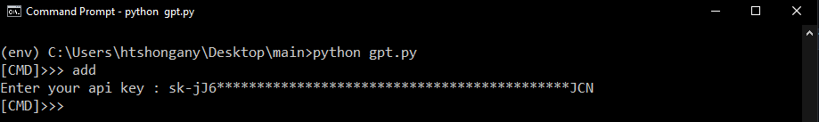
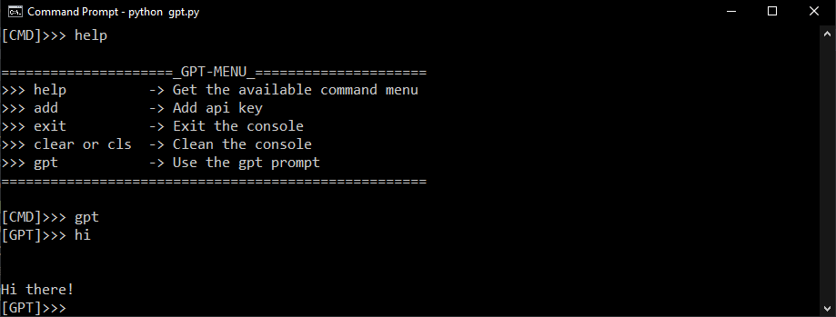

# simple gpt console prompt 


## Create an environment

```cmd 
python -m venv env
(env) C:\Users\..\gpt-console>
```
## Activate the environment

Before starting the project, activate env

```cmd 
(env) C:\Users\..\gpt-console> env/Scripts/activate
```
# Install openai

Within the activated environment, use the following command to install openai

```cmd
pip install -r requierements.txt 
```
```cmd 
python gpt.py 
```
<h2> how to add an api key </h2>



<h2> how to use the GPT console </h2>

